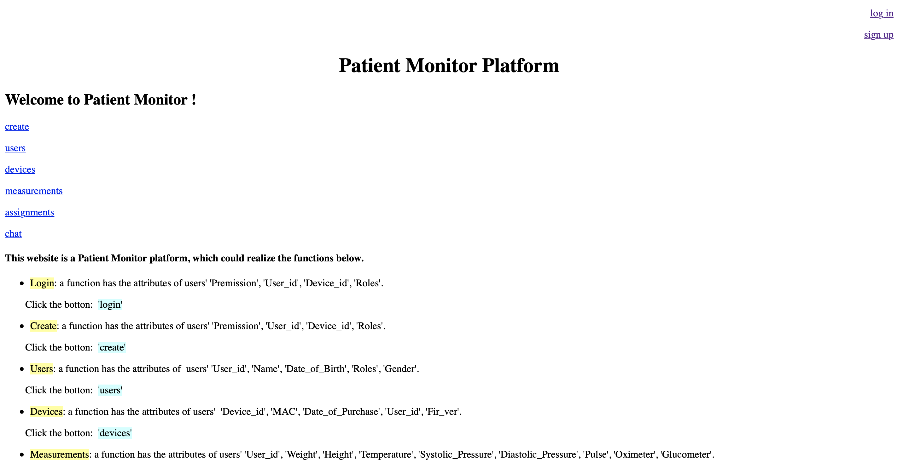
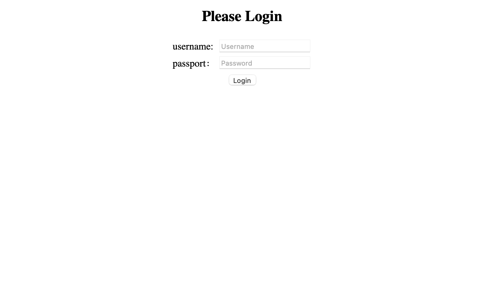

## Login

Flask-login provides common Login tasks, such as Login and logout and the current user, through a user session.



After the user submits the username and password, we need to verify that the username and password are correct. In order to compare, there should be a place to store the user name and password in our system, and the background system will store it through the database.



After login, we need to maintain the user login state, so that the user can determine whether the user has logged in when visiting a specific web page, and whether the user has access to change the web page. This needs to maintain a session to save the user login state and user information.

When the request arrives, we will first check the user's information, such as whether they have logged in, whether they have permission, etc. If the check is passed, the corresponding webpage will be replied to the user in response. But if the check fails, an error message needs to be returned. If a wrong username or password is submitted, we use flash to show the wrong message.


Flask-wtf and WTF are used to implement forms functions. Flask-wtf does some encapsulation of WTF. Flask-wtf and WTF are mainly used to establish the correspondence between HTML elements and Python classes, and control HTML elements by manipulating corresponding classes or objects in Python code. We need to use flask-wtf and WTF in Python code to define the front page form (essentially a form class) and pass the corresponding form object as an argument to render_template. J then renders the corresponding template into HTML text and returns it to the user as an HTTP response.

```
# forms.py
from flask_wtf import FlaskForm
from wtforms import StringField, BooleanField, PasswordField
from wtforms.validators import DataRequired

class LoginForm(FlaskForm):
    username = StringField('User Name', validators=[DataRequired()])
    password = PasswordField('Password', validators=[DataRequired()])
    remember_me = BooleanField('remember me', default=False)

```

```
@application.route('/login', methods=['GET', 'POST'])
def login():
    if request.method == 'POST':
        user_id = request.form.get('userid')
        user = query_user(user_id)
        if user is not None and request.form['password'] == user['password']:

            curr_user = User()
            curr_user.id = user_id

            login_user(curr_user)

            return redirect(url_for('index'))

        flash('Wrong username or password!')
    return render_template('login.html')
```

## Register
For the registration part, we need to store passwords. However, if the username and password are simply stored in plain text, user information may be leaked. In this case, encrypt the user name before storing it. We can start by defining a User class that handles user-specific operations, including storage and validation.


The User class needs to inherit the UserMixin class from flask-Login for User session management. We store user information directly into a JSON file. Instead of storing passwords directly, we store encrypted hash values, using the generate_password_hash function in the Werkzeug. Security package. Since this function uses the SHA1 algorithm by default and adds a salt value of length 8, it is quite safe. It's good enough for general purposes. To verify the password, use the check_password_hash function in the Werkzeug. Security package to verify the password.

```
# models.py

from werkzeug.security import generate_password_hash
from werkzeug.security import check_password_hash
from flask_login import UserMixin
import json
import uuid

# define profile.json constant, the file is used to
# save user name and password_hash
PROFILE_FILE = "profiles.json"

class User(UserMixin):
    def __init__(self, username):
        self.username = username
        self.id = self.get_id()

    @property
    def password(self):
        raise AttributeError('password is not a readable attribute')

    @password.setter
    def password(self, password):
        """save user name, id and password hash to json file"""
        self.password_hash = generate_password_hash(password)
        with open(PROFILE_FILE, 'w+') as f:
            try:
                profiles = json.load(f)
            except ValueError:
                profiles = {}
            profiles[self.username] = [self.password_hash,
                                       self.id]
            f.write(json.dumps(profiles))

    def verify_password(self, password):
        password_hash = self.get_password_hash()
        if password_hash is None:
            return False
        return check_password_hash(self.password_hash, password)

    def get_password_hash(self):
        """try to get password hash from file.

        :return password_hash: if the there is corresponding user in
                the file, return password hash.
                None: if there is no corresponding user, return None.
        """
        try:
            with open(PROFILE_FILE) as f:
                user_profiles = json.load(f)
                user_info = user_profiles.get(self.username, None)
                if user_info is not None:
                    return user_info[0]
        except IOError:
            return None
        except ValueError:
            return None
        return None

    def get_id(self):
        """get user id from profile file, if not exist, it will
        generate a uuid for the user.
        """
        if self.username is not None:
            try:
                with open(PROFILE_FILE) as f:
                    user_profiles = json.load(f)
                    if self.username in user_profiles:
                        return user_profiles[self.username][1]
            except IOError:
                pass
            except ValueError:
                pass
        return unicode(uuid.uuid4())

    @staticmethod
    def get(user_id):
        """try to return user_id corresponding User object.
        This method is used by load_user callback function
        """
        if not user_id:
            return None
        try:
            with open(PROFILE_FILE) as f:
                user_profiles = json.load(f)
                for user_name, profile in user_profiles.iteritems():
                    if profile[1] == user_id:
                        return User(user_name)
        except:
            return None
        return None
```

### Logout

```
@application.route('/logout')
def logout():
    logout_user()
    return render_template('index.html')
```
We have achieved a complete login and logout process.